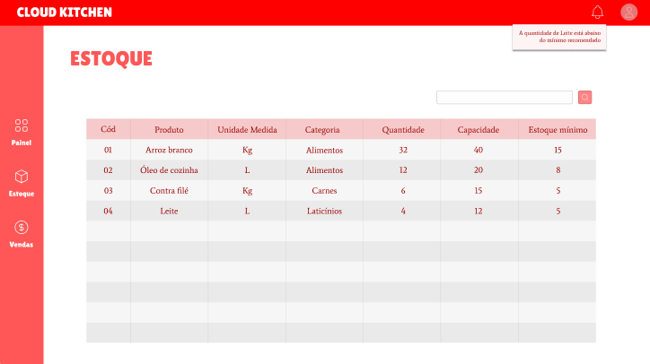
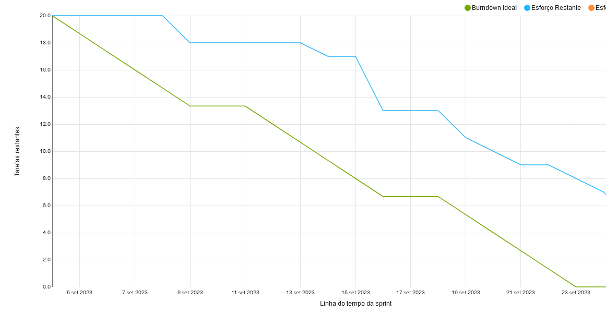
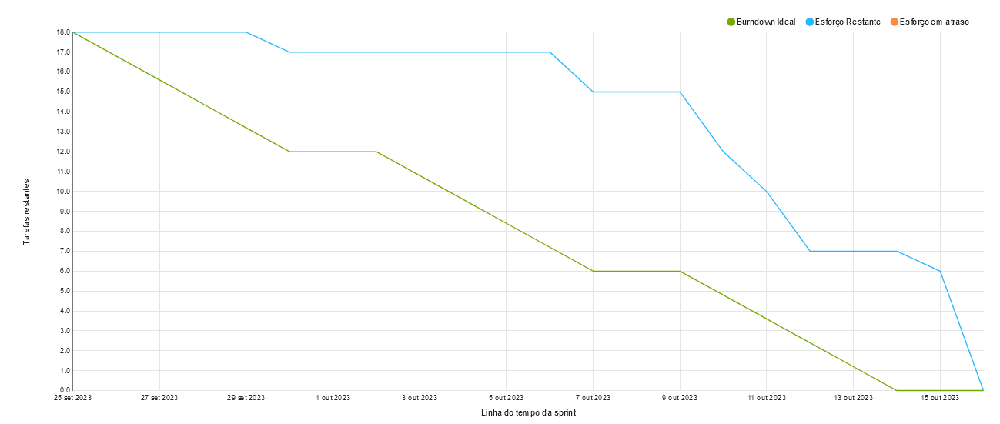

<h4 align="center"> 
 
 
 
</h4>

## ✏️ **CHALLENGE**
Create a comprehensive online platform for efficient restaurant management, offering features such as dashboards, graphs, reports, and personnel, supplier, and inventory management. The goal is to assist restaurant owners in addressing challenges like cost control, team management, and inventory, aiming to enhance their operations.

Functional Requirements

    Develop an organizational panel of personnel and suppliers and inputs;
    Develop an employee flow dashboard, people flow, inventory, best selling dishes;
    Develop a comparator of customers x staff x stock, another comparator of predictability of inputs for preparing dishes;
    In the comparator, check the inputs and present what needs to be purchased, in the personnel comparator, consider the flow of customers.

Non-Functional Requirements

    The website's response time must be below 1000ms in 99.99% of the requests;
    The application's logging mechanism must generate the trails in JSON format (optional);
    The system must contain metrics that help to observe its behavior: Quantity of requests, response time, quantity and percentage of failures when obtaining data from Golden Sources.

## Solution
A web-based platform designed to streamline restaurant management through intuitive graphic panels and interactive dashboards. This platform offers insights into employee performance, inventory management, and customer interactions.

## 📅 **SPRINTS SCHEDULE**

- [x] **Kickoff** - 

- [x] **SPRINT 1** - 04/09/2023 a 24/09/2023

- [x] **SPRINT 2** - 25/09/2023 a 15/10/2023

- [x] **SPRINT 3** - 16/10/2023 a 05/11/2023

- [x] **SPRINT 4** - 06/11/2023 a 26/11/2023

## 🎯 **BACKLOG**
<table>
  <thead>
    <tr>
      <th>User Story</th>
      <th>Priority</th>
    </tr>
  </thead>
  <tbody>
    <tr>
      <td>
Inventory and Supplies Management Panel

      As a restaurant owner, I need a supplies panel to monitor the status of my inventory, including expiration dates, quantity, and the flow of items in and out.</td>
      <td>High</td>
    </tr>
    <tr>
      <td>
        
Daily Revenue Panel

          As a restaurant owner, I need a Revenue Panel to visualize the flow of monetary operations.
      </td>
      <td>High</td>
    </tr>
    <tr>
      <td>
        
Vendor Panel

        As a restaurant owner, I need a vendor panel so that I can see the best choice of supplier according to my needs.
      </td>
      <td>Medium</td>
    </tr>
    <tr>
      <td>
        
Inventory and Supplies Dashboard

        As a restaurant owner, I need a supplies dashboard to visualize and quantify the stock needs.
      </td>
      <td>Medium</td>
    </tr>
    <tr>
      <td>
        
Employee Dashboard

        As a restaurant owner, I want an employee dashboard so that I can understand the performance of the employees and their availability.
      </td>
      <td>Medium</td>
    </tr>
    <tr>
      <td>
        
Employee Management Panel

        As a restaurant owner, I want a people panel so that I can understand the labor resources I have to choose from.
      </td>
      <td>Low</td>
    </tr>
    <tr>
      <td>
        
People/Customers Dashboard

        As a restaurant owner, I need a people/customers dashboard to understand the required personnel for the opening hours.
      </td>
      <td>Low</td>
    </tr>
  </tbody>
</table>

## Mockup
Painel Insumos

## Burndown 
### Sprint 1

### Sprint 2

## 💻 **TECHNOLOGY AND TOOLS**

Back-End

- `Java`
- `Spring boot`

Front-End

- `Vue`

Database

- `Oracle Autonomous Database`

Tools

- `Intellij`
- `Visual Studio code`

## Modelagem de dados 📊

